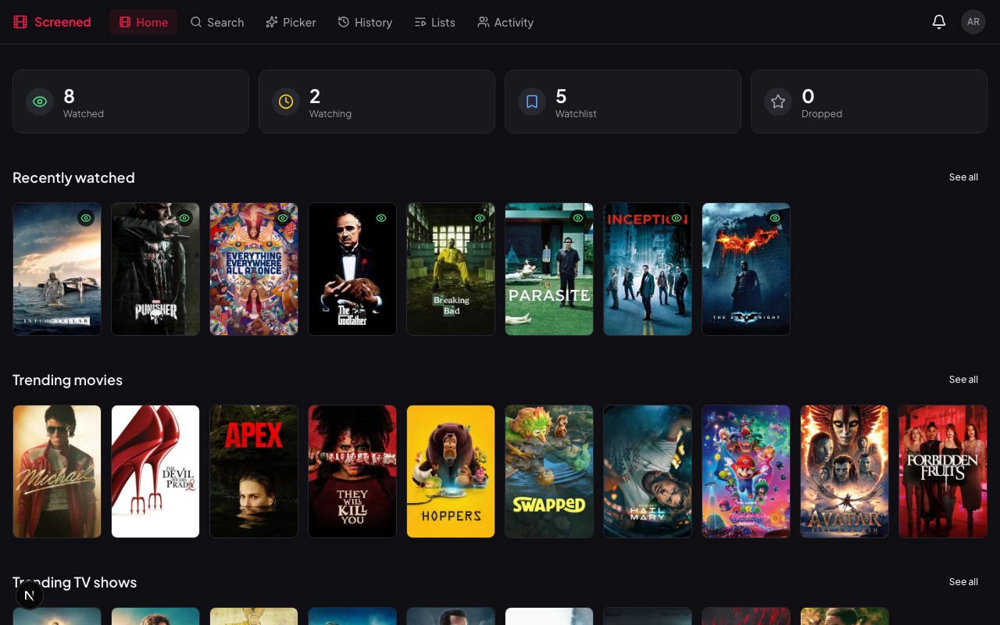
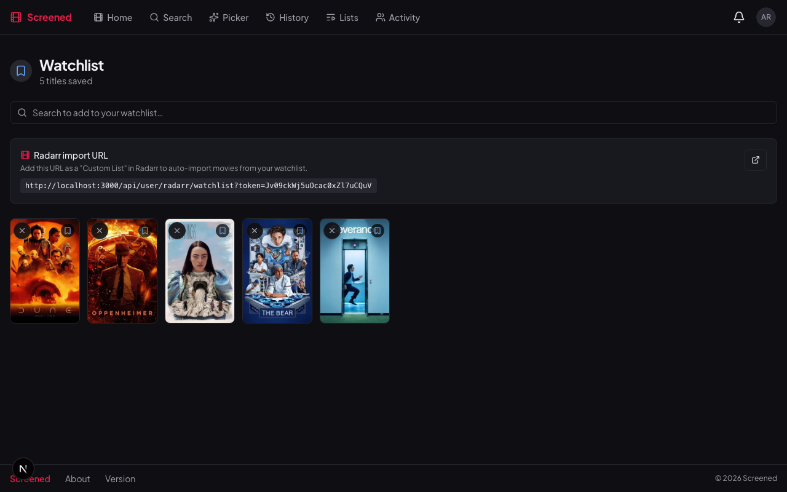
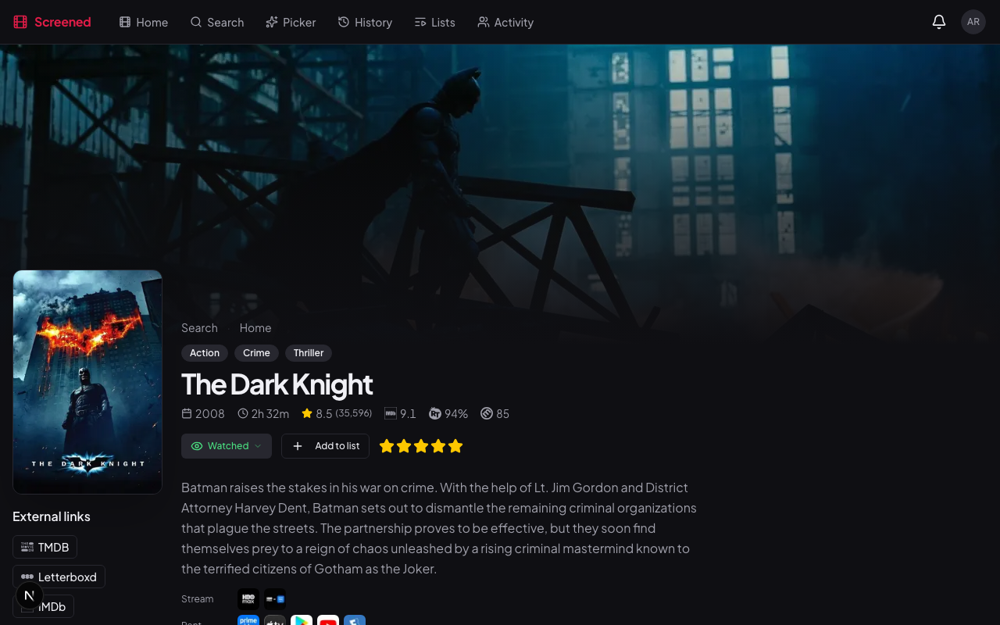
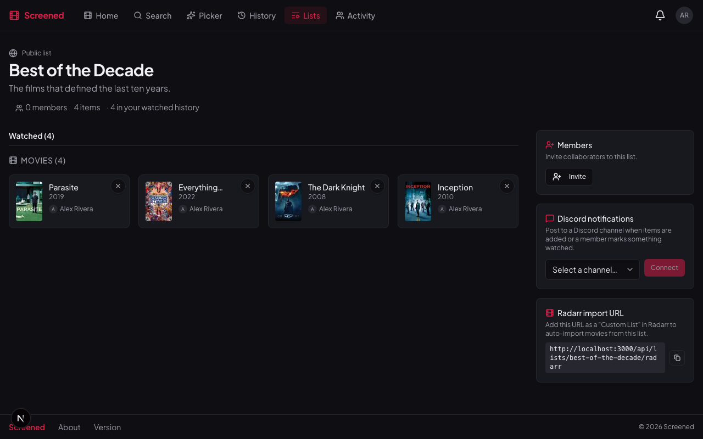

<p align="center">
  
</p>

<p align="center">
  <a href="https://github.com/jamiebclark/screened/actions/workflows/ci.yml"></a>
  <a href="https://github.com/jamiebclark/screened/releases"></a>
  <a href="https://hub.docker.com/r/jamiebclark/screened"></a>
  <a href="LICENSE"></a>
</p>

<p align="center">A self-hosted web app for tracking movies and TV shows with friends, Plex sync, and Radarr integration.</p>

---

## Features

- **Personal tracking** — watchlist, watching, watched, dropped status with star ratings and reviews
- **Episode tracking** — per-episode progress for TV shows with notes and watch timestamps
- **Collaborative lists** — shared movie lists with member invites; each list exports a live Radarr endpoint
- **Plex sync** — import your watch history automatically; manual and scheduled sync supported
- **Letterboxd** — connect your public profile to import diary entries and ratings
- **Movie Night Picker** — collaborative "what should we watch?" sessions with reference-title scoring
- **Watch history** — unified log across Plex, Letterboxd, and manual entries with a calendar view
- **Discord integration** — channel webhooks, slash commands, and DM notifications (optional)

---

## Screenshots

<p align="center">
  
  
</p>
<p align="center">
  
  
</p>

---

## Quick Start

```bash
curl -o .env https://raw.githubusercontent.com/jamiebclark/screened/main/.env.example
curl -o docker-compose.yml https://raw.githubusercontent.com/jamiebclark/screened/main/docker-compose.yml
# edit .env — set TMDB_API_KEY, AUTH_SECRET, NEXTAUTH_URL, NEXT_PUBLIC_APP_URL
docker compose up -d
```

The app will be available at `http://localhost:3000`. The first user to register gets admin access.

**→ [Full deployment guide](docs/deployment.md)** — env var reference, sync scheduling, backup & restore, manual setup

---

## Documentation

| Guide                                  | Audience                                               |
| -------------------------------------- | ------------------------------------------------------ |
| [Deployment](docs/deployment.md)       | Docker Compose, env vars, manual setup                 |
| [Plex](docs/plex.md)                   | Connecting your Plex account and syncing watch history |
| [Letterboxd](docs/letterboxd.md)       | Importing your diary and ratings                       |
| [Lists & Radarr](docs/lists.md)        | Collaborative lists and auto-downloading via Radarr    |
| [Movie Night Picker](docs/picker.md)   | How the Picker and scoring work                        |
| [Watch Parties](docs/watch-parties.md) | Scheduling and inviting friends to watch together      |
| [Discord](docs/discord-integration.md) | Webhooks, slash commands, and DM notifications         |
| [Contributing](CONTRIBUTING.md)        | Local dev setup, commit conventions, PR checklist      |

---

## Tech Stack

| Layer      | Technology                            |
| ---------- | ------------------------------------- |
| Framework  | Next.js (App Router) + TypeScript     |
| Styling    | Tailwind CSS v4 + Radix UI            |
| Database   | PostgreSQL + Prisma                   |
| Auth       | Auth.js v5 (credentials + Plex OAuth) |
| Metadata   | TMDB API                              |
| Deployment | Docker Compose                        |

---

## Development

### Available scripts

| Command            | Description                       |
| ------------------ | --------------------------------- |
| `yarn dev`         | Start development server          |
| `yarn build`       | Build for production              |
| `yarn lint`        | Run ESLint                        |
| `yarn db:migrate`  | Run Prisma migrations             |
| `yarn test:e2e`    | Playwright end-to-end tests       |
| `yarn db:studio`   | Open Prisma Studio (database GUI) |
| `yarn db:generate` | Regenerate Prisma client          |

### Project structure

```
src/
├── app/
│   ├── (auth)/          # Login and register
│   ├── (app)/           # App shell: home, search, pick, watchlists, lists, movies, TV, settings, history, …
│   └── api/             # Route handlers (media, lists, plex, letterboxd, picker, cron, auth, …)
├── components/          # Feature UI and components/ui (Radix + Tailwind)
├── generated/           # Prisma client output (from prisma/schema.prisma)
└── lib/                 # auth, prisma, tmdb, plex, letterboxd, embeddings, picker state, etc.
```

Prisma schema and migrations live under `prisma/`; the generated client is written to `src/generated/prisma` (not committed).

### Commits

This project uses [Conventional Commits](https://www.conventionalcommits.org/). Releases and changelogs are automated via [semantic-release](https://semantic-release.gitbook.io/).

```
feat(lists): add CSV import for watchlists
fix(plex): handle expired tokens gracefully
docs: update Radarr setup instructions
```
